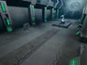
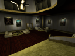
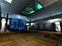
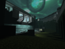

# HOSAE hogsy's Open-Source Anachronox Engine

## What is this?

This is an open-source reimplementation of Anachronox, built on top of the
Quake 2 engine (which funnily enough is the same engine Anachronox was
developed upon).

It's important to note that this project is operating to reimplement the game through 
publicly available documentation and observation, rather than dissassembly, which should 
hopefully be fine from a legal standpoint.

## Project Goals

- Reimplement Anachronox (duh)
- Support for multiple platforms; linux, android and more
- Make the game easier to modify
- Improved visuals

## Features

It's still in a very early stage of development so nothing is playable yet.
Below is a list of what's been done thus far.

- Loading from Anachronox's _DAT_ packages
- Engine can initialize itself from the Anachronox game directory
- Some preliminary work on loading Anachronox's models
- Supports the various texture formats Anachronox uses (e.g. PNG, BMP and TGA)
- Respects custom texture surface flags, inc. alpha effects for textures
- Extended limits, which is necessary for some maps to load

### Extras

These are extra features, the original game didn't necessarily feature, that this engine introduces.

- Can target either x86 and x64 architectures
- Overbrights via `r_overbrights` (just be wary Anachronox's art was not designed for it)
- Higher-resolution texture replacements can be loaded in
    - Replacement textures need to be placed under a `hd` directory located under `anoxdata`
    - Can be enabled/disabled via `hd_override` cvar
- Replaced QGL with GLEW
- Code is compiled as C++, as opposed to C

## Wow, neat! How can I help?

If you have experience with either C/C++, have a passion for programming and familiarity with the Anachronox game, then feel free to get in touch via our [Discord](https://discord.gg/EdmwgVk) server in the `#anachronox` channel.

Alternatively, feel free to ping me an email at [hogsy@oldtimes-software.com](mailto:hogsy@oldtimes-software.com).

## Resources

- [Anachrodox](https://anachrodox.talonbrave.info/)
