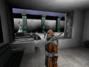

# HOSAE hogsy's Open-Source Anachronox Engine

## What is this?

This is an open-source reimplementation of Anachronox, built on top of the
Quake 2 engine (which funnily enough is the same engine Anachronox was
developed upon).

It's important to note that this project is operating to reimplement the game through 
publicly available documentation and observation, rather than dissassembly, which should 
hopefully be fine from a legal standpoint.

## Project Goals

- Reimplement Anachronox (duh)
- Support for multiple platforms; linux, android and more
- Make the game easier to modify (i.e. support for larger texture sizes)
- Improved visuals

## Features

It's still in a very early stage of development so nothing is playable yet.
Below is a list of what's been done thus far.

- 64-bit support
- Support for loading from Anachronox's data packages; engine can initialize itself from the Anachronox game directory
- Some preliminary work on loading Anachronox's models
- Support for the various texture formats Anachronox uses (e.g. PNG, BMP and TGA)
- Replaced QGL with GLEW
- Code is compiled as C++, as opposed to C
- Overbrights via `r_overbrights` (just be wary Anachronox's art was not designed for it)
- Fixed a number of potential buffer overflows in the Q2 engine

## Wow, neat! How can I help?

If you have experience with either C/C++, have a passion for programming and familiarity with the Anachronox game, then feel free to get in touch via our [Discord](https://discord.gg/EdmwgVk) server in the dedicated `#hosae` channel.

Alternatively, feel free to ping me an email at [hogsy@oldtimes-software.com](mailto:hogsy@oldtimes-software.com).

## Why 'HOSAE'?

I couldn't come up with a better name for the project at the time.
Hosae is pretty much a placeholder name for the time being anyway 
until the project is a bit further along, and I thought it fit well with the humour of the game.
